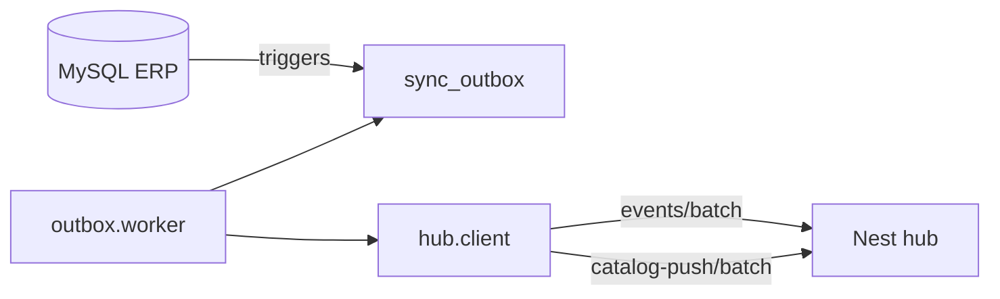

# Arquitectura Python — Multishop-nodo-API

Agente FastAPI en tienda (MySQL ERP + VPN al hub). **Fuente única** del código Python del nodo en este monorepo.

## Arranque y despliegue

| Requisito | Detalle |
|-----------|---------|
| `cwd` | Raíz de `Multishop-nodo-API/` (donde está `main.py`) |
| Comando | `python main.py` o venv `Scripts/python main.py` (Windows) |
| Config | `.env` en la raíz (`config.py` / `core.config`) |
| Instalador Windows | `robocopy /E` copia todo el árbol; no depende de nombres planos en raíz salvo `main.py` |

## Layout por dominio

```text
Multishop-nodo-API/
  main.py, api.py          # entrada HTTP
  config.py                # shim → core.config (settings)
  routes/, middleware/
  core/                    # json, logging, trace
  db/                      # MySQL cliente + stores sinv/sprv
  hub/                     # cliente HTTP al Nest
  outbox/                  # sync_outbox → hub (transaccional + catálogo)
  catalog/                 # push/pull catálogo masivo y compare
  sync/                    # hub→tienda (PGMQ), apply, jobs
  workers/                 # Huey (outbox + catalog jobs)
  scripts/                 # instalación, triggers, tests
```

## Mapa módulo histórico → ubicación actual

| Antes (raíz) | Ahora |
|--------------|-------|
| `hub_client.py` | `hub/client.py` |
| `node_catalog.py` | `hub/catalog_snapshot.py` |
| `outbox_mysql.py` | `outbox/mysql.py` |
| `outbox_worker.py` | `outbox/worker.py` |
| `outbox_send_result.py` | `outbox/send_result.py` |
| `catalog_outbox.py` | `outbox/catalog_push.py` |
| `catalog_push_digest.py` | `outbox/digest.py` |
| `db_mysql.py` | `db/mysql.py` |
| `sinv_store.py`, `sprv_store.py`, `sinv_compare.py` | `db/` |
| `catalog_compare.py`, `catalog_apply.py` | `catalog/` |
| `push_*`, `pull_*` | `catalog/push/`, `catalog/pull/` |
| `sync_apply.py`, `sync_store.py`, … | `sync/` |
| `sync_job_*.py` | `sync/jobs/` |
| `huey_app.py`, `huey_tasks.py` | `workers/` |
| `json_util.py`, `log_compat.py`, `categoria_trace.py` | `core/` |

Los archivos `.py` en la raíz que queden son **shims de compatibilidad** (re-export) o entrada (`main.py`); ver comentario `Deprecated` en cada shim.

## Reglas de imports

1. **Código nuevo:** importar desde el paquete (`from hub.client import HubClient`), no desde shims de raíz.
2. **No** añadir módulos de negocio nuevos en la raíz.
3. **Evitar** ciclos: `hub/` no debe importar `catalog/push/`; `outbox/catalog_push` usa `Protocol` para el hub.
4. Scripts y tests: ejecutar desde la raíz del proyecto; `PYTHONPATH` implícito = cwd.

## Flujos principales



- **Transaccional:** `kardex` / `comprasdbf` / `ventasi` / `detalle` → `POST /api/nodo/events/batch`.
- **Catálogo ERP:** `catego` / `sprv` / `sinv` → digest en `catalog_push_digest` → `POST /api/nodo/catalog-push/.../batch`.
- **Hub → tienda:** `POST /api/sync/events` (PGMQ); ver `sync/apply.py`.

## Relacionado

- [docs/nodo-integracion-hub.md](../../docs/nodo-integracion-hub.md)
- [docs/nodo-windows-tienda.md](../../docs/nodo-windows-tienda.md)
